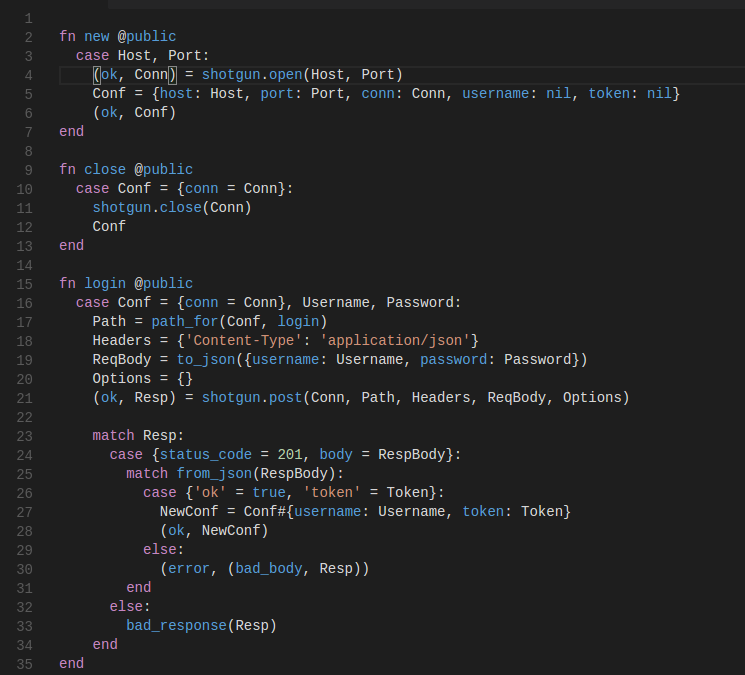

# Efene - Visual Studio Code

Basic syntax highlighting support for Efene in VS Code.

Inspired by [alpaca-vscode](https://github.com/alpaca-lang/alpaca-vscode)

## Features

Basic syntax highlight support for [efene](http://efene.org).

## Requirements

None at present.

## Release Notes

Currently supports basic syntax highlighting (symbols, constants, keywords).
